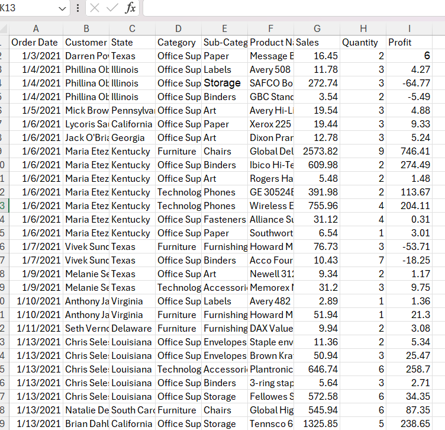
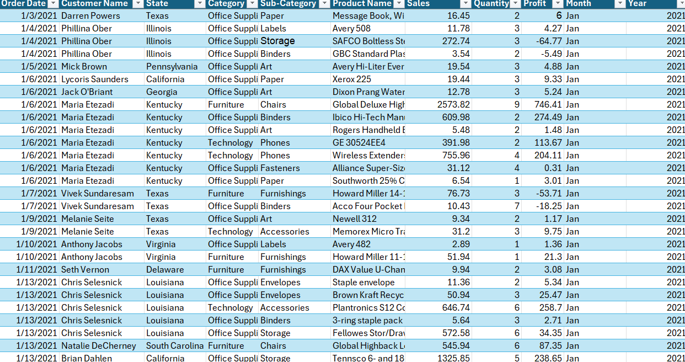
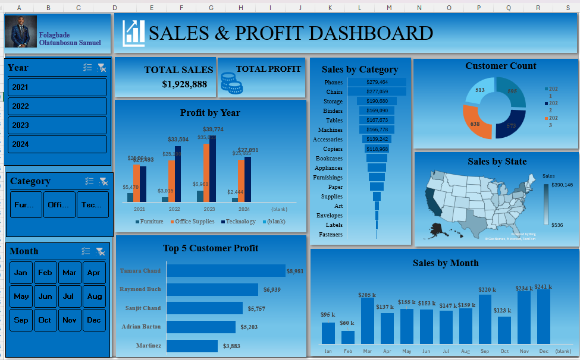

# 📊 EXCEL-SALES-AND-PROFIT-DASHBOARD

This project showcases a **Sales &amp; Profit Dashboard in Excel** that provides insights into total sales, profit trends, sales by category, customer count, geographical performance, monthly sales, and top customers. Built with PivotTables, charts, and slicers, the dashboard offers an interactive way to analyze business performance.
# Introduction
The Sales & Profit Dashboard is designed to provide a clear and interactive view of business performance using Microsoft Excel. By combining data cleaning, PivotTables, charts, and slicers, this project transforms raw sales data into meaningful insights.
The dashboard allows users to quickly track key performance indicators (KPIs) such as total sales and profit, while also exploring trends by year, product category, customer segments, geography, and monthly patterns.
This project serves as both a practical business tool for decision-making and a learning resource for anyone interested in Excel-based data analysis and dashboard creation.
## 🚀 Features
This dashboard highlights the following key insights and visualizations:
- Key Metrics Overview – Quick snapshot of Total Sales and Total Profit
- Profit by Year Chart – Visualize yearly profit trends and spot growth opportunities
- Sales Breakdown by Category – Understand product/category contributions
- Customer Count by Year – Analyze engagement trends with a pie chart
- Sales by State Map – Geographical sales performance using an Excel map chart
- Monthly Sales Trends – Identify seasonal patterns with monthly breakdowns
- Top 5 Customers Profits – Focus on high-value customers for better decision-making
## Tools used
- Microsoft Excel – Primary tool for data cleaning, analysis, and dashboard creation
- PivotTables & PivotCharts – For summarizing and visualizing key business metrics
- Excel Functions – Such as SUMIFS, IF, VLOOKUP/XLOOKUP, and calculated fields
- Slicers & Filters – To enable interactivity and dynamic data exploration
- Data Visualization – Column charts, line charts, pie charts, and map charts for insights presentation
## 🔎Data Preparation
The dashboard was built from raw sales transaction data containing information such as Order Date, Customer, Category, State, Sales, and Profit. To ensure accuracy and consistency, the following steps were taken:
### Raw Data
- Original dataset included customer details, product categories, regions, and sales values.
- Contained duplicates, missing values, and inconsistent formatting.
### Cleaning Steps
- Removed duplicates and blank rows
- Standardized column names and formats (e.g., dates, currency)
- Handled missing or incorrect values
- Added calculated fields such as =TEXT, =YEAR for Month, and Year.
- Ensured consistent category labels for analysis
### Cleaned Data
- Structured dataset ready for analysis in Excel
- Used as the foundation for PivotTables, Charts, and Dashboard Design
  
 **Raw Data**        |   **Cleaned Data**
:------------------: |  :---------------------:
     |  
## 📸Dashboard Preview
Below is the final Sales & Profit Dashboard created in Excel:
Key Visuals Displayed:
- Total Sales & Profit KPIs for quick business performance snapshot
- Profit by Year Trends to track yearly growth
- Sales Breakdown by Category to compare product contributions
- Customer Count by Year showing engagement distribution
- Sales by State Map for geographical insights
- Monthly Sales Trends to identify seasonal patterns
- Top 5 Customers Profits highlighting high-value customers
  
  ## 📈Insights Gained
 From the Sales & Profit Dashboard, the following key insights were identified: 
- 📊 Yearly Profit Growth – Clear upward/downward trends in profitability over time
- 🛒 Category Contribution – Identified top-performing product categories driving revenue
- 👥 Customer Engagement – Annual customer count trends showing business reach
- 🌍 Regional Performance – States contributing the most/least to overall sales
- 📅 Seasonal Trends – Monthly sales patterns highlighting peak and low seasons
- 💰 High-Value Customers – Top 5 customers generating the highest profits
These insights enable businesses to make data-driven decisions, focus on growth opportunities, and strengthen customer relationships.
## 👨‍💻 Author
### Folagbade Olatunbosun Samuel
- 💼 LinkedIn:https://www.linkedin.com/in/olatunbosun-folagbade-559151243/
- 📧 Email:Folagbadeolatunbosun@gmail.com

  
